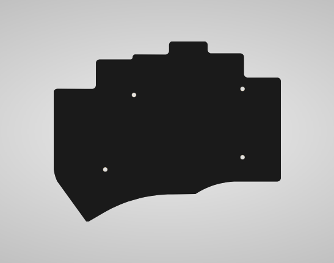

# Tweaked Ferris Sweep

A fork of [David Barr's Sweep](https://github.com/davidphilipbarr/Sweep).

| Front | Back |
| :---: | :---: |
|  |  |
|  |  |
|  |  |

### Features

* Low profile Kailh Choc switches
* Hotswap
* Dual side-scrolling encoder
* Oled screens
* Power switch for battery management
* Bluetooth support w/ nice!nano
* Plate style case with mcu cover

### Components list

To build and use this Ferris Sweep you will need:

* 1 × PCB Kit (1.6mm thickness is good)
* 1 × back plate kit (optional, you can go for 1.2mm thickness)
* 2 × promicro compatible boards ( I used the Elite C ) or 2 x nice!nanos.
* 34 × Kailh Choc v1 switches
* 34 × Kailh Choc hotswap sockets (PG1350)
* 34 × keycaps
* 2 × side-scrolling encoders EVQWGD001
* 2 × OLED LCD Display 128x32 SSD1306 (optional)
* 2 × reset switches (optional; B3U-1000P(M))
* Some little rubber feet/bumpers (a minimum of 4 on each side)
* 2 × power switches (wireless only; MSK 12C02)
* 2 × lipo batteries (wireless only; 301230 or 301228)
* 1 × TRRS (not TRS!) cable (wired only)
* 2 × TRRS Jack [PJ-320A] (wired only)
* 1 × USB Cable (depends on your micro-controller choice)

##